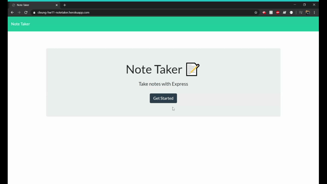

# Homework 11: Note Taker

## Description

Create an application that uses express backend to write, save, and delete notes from a JSON file.

### Usage
To use this application in the browser, visit [Note Taker](https://cleung-hw11-notetaker.herokuapp.com/)

Add a title and text to your note. Once these have been entered a save button will appear in the upper right hand corner. If a task is completed, click the delete button next to the task. The rest of your notes will be saved when you visit the browser again. 

To view this application in a terminal, navigate to the folder with app.js and run the following commands:
- npm i 
- node .\app.js

## Technologies
  * node.js
    * express NPM
    * fs NPM
    * path NPM
    * uuid NPM
  * HTML
  * CSS

## Challenges
The challenges for this homework was making sure the notes were being rendered and deleted correctly using unique ids. 

## Screenshot
